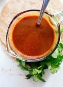

# Red Enchilada Sauce
Sauce for enchiladas, and it's red.

## Ingredients
- 3 tablespoons olive oil
- 3 tablespoons flour (whole wheat flour, all-purpose flour and gluten-free flour blends all work!)
- 1 tablespoon ground chili powder (scale back if you’re sensitive to spice or using particularly spicy chili powder)
- 1 teaspoon ground cumin
- ½ teaspoon garlic powder
- ¼ teaspoon dried oregano
- ¼ teaspoon salt, to taste
- Pinch of cinnamon (optional but recommended)
- 2 tablespoons tomato paste
- 2 cups vegetable broth
- 1 teaspoon apple cider vinegar or distilled white vinegar
- Freshly ground black pepper, to taste

## Instructions
1. This sauce comes together quickly once you get started, so measure the dry ingredients (the flour, chili powder, cumin, garlic powder, oregano, salt and optional cinnamon) into a small bowl and place it near the stove. Place the tomato paste and broth near the stove as well.
2. In a medium-sized pot over medium heat, warm the oil until it’s hot enough that a light sprinkle of the flour/spice mixture sizzles on contact. This might take a couple of minutes, so be patient and don’t step away from the stove!
3. Once it’s ready, pour in the flour and spice mixture. While whisking constantly, cook until fragrant and slightly deepened in color, about 1 minute. Whisk the tomato paste into the mixture, then slowly pour in the broth while whisking constantly to remove any lumps.
4. Raise heat to medium-high and bring the mixture to a simmer, then reduce heat as necessary to maintain a gentle simmer. Cook, whisking often, for about 5 to 7 minutes, until the sauce has thickened a bit and a spoon encounters some resistance as you stir it. (The sauce will thicken some more as it cools.)
5. Remove from heat, then whisk in the vinegar and season to taste with a generous amount of freshly ground black pepper. Add more salt, if necessary (I usually add another pinch or two). Go forth and make enchiladas!
